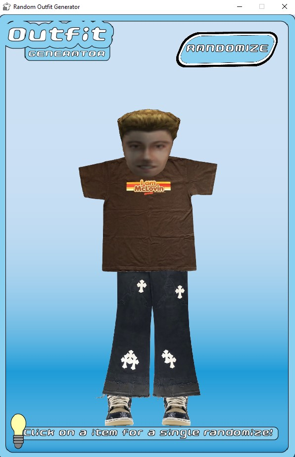

# CS110 Project Proposal
# Random Outfit Generator 
## CS 110 Final Project
### Spring 2022
### Ever been indecisive and didn't know what outfit you wanted to wear for the day? This is the perfect project for you then. You import your clothing and then you can either randomize the speific clothing on whatever part of your body you desire of if you realy don't know what you want to wear you can randomize everything. 

<< [repl](#) >>

### Presentation Slides
https://docs.google.com/presentation/d/1IqmnRE14ZFnZqptrWbfXia5kWDbTcCo0-SPAfcaYtyM/edit?usp=sharing
### Demonstration 
https://drive.google.com/file/d/12WxcctraiXip6Q8LMF8KaGhnivgAicmS/view?usp=sharing

### Team: Python Gang
#### Team Members
* Michelle Kang- Software Lead
* Christopher Micu- Front End Specialist
* Alexander Rodriguez- Back End Specialist

***

## Project Description *(Software Lead)*

For our final project, we created a random outfit generator using 3 different clothing pieces. We wanted to help those who have a hard time deciding what to wear for the day. Our program has a variety of shirts, pants, and shoes randomly generated and layed out for the user to get inspiration for their own outfits. Simply click run to get your first outfit, and if you do not like the first one try running the program again or clicking on the head, shirt, pant, or shoes to change it until you find the outift you like.

***    

## User Interface Design *(Front End Specialist)*
Start Menu:

Screen:

Final Screen:

   
* Final GUI
   
***        

## Program Design *(Backend Specialist)*

* Non-Standard libraries
  * N/A
    * For each additional module you should include
        * url for the module documentation
        * a short description of the module
          
* Class Interface Design
      
      
* Classes
    * Controller- runs the mainloop for generating a ramdom outfit and stops when the outfit is made
    * Head- contains the position and images of various heads
    * Shirt- contains the position and images of various shirts
    * Pant- contains the position and images of various pants
    * Shoe- contains the position and images of various shoes
    * ranButton- contains the position and image of the randomize button

## Project Structure *(Software Lead)*

The Project is broken down into the following file structure:

* main.py
* .github
* src
    * controller.py, head.py, shirt.py, pant.py, shoe.py, rbutton.py
* assets
    * Pants, Shirts, Shoes, Heads, Randomize Button, Background 
    * class diagram, exclass diagram, finalGUI
* etc
    * <This is a catch all folder for things that are not part of your project, but you want to keep with your project. Your demo video should go here.>

***

## Tasks and Responsibilities *(Software Lead)*

As a team, we were able to brainstorm a project idea that we all liked and assigned responsbilities that we agreed were fair to all of us. We got started by finding external clothing, backgrounds, and code information so that Alex could implent as he was coding. After Alex is researching and implementing his code, Michelle and Chris were able to check over the code to see if it is dry and make sure everything in the proposal is completed. We all gathered to check over the replit for any errors or imcompletion before it is submitted. 

### Software Lead - Michelle

Michelle is the Software Lead in our team and is responsible for taking all the code from the Front End Specialist and Back End Specialist and bringing it all together into this repl. She also made sure the slides and presentation follow the rubric. Made sure the entire team worked in unison and along with Chris, made sure the entire code ran smoothly and the project is ready to submit.

### Front End Specialist - Christopher Micu

Christopher is the Front End Specialist in our team and is also responsible for coding, as well as completing most of the presentation and script. He will be coding the background hand in hand with Alex. Conducted significant research by finding different pieces of clothing required for our program, as well as the background. He made sure they were all of similar sizes with transparent background.

### Back End Specialist - Alex

Alexander is the Backend Specialist in our team. He is responsible for the writting the main driver code and conducted research in order to do so. He also worked on coding most of the components such as the background and the change of clothes as inputted by the user. He is also aided by the Chris with finding references for the main code.

## Testing *(Software Lead)*

In our testing strategy, we planned to run the random feature one by one as we implemented each of the 3 clothing classes. Although it is not a class, the background was the very first function we implemented along with the desired screen size. After we were able to run the background and screen sucessfully we moved on. The shirt class was the first coded and ran multiple times using a user-based test to check for errors. We did this for each class before moving onto the next. 

## ATP

| Step          | Procedure     | Expected Results | Actual Results |
|-----------|:-------------:| :-----------------| -------------- |
|  1  | Click on run to begin | The GUI window opens and generates a random set of clothes|
|  2  | Click on the head on the screen | The head randomly changes to another head|         
|  3  | Click on the shirt on the screen | The shirt randomly changes to another shirt
|  4  | Click on the pants on the screen| The pant randomly changes to another pant
|  5  | Click on the shoe on the screen | The shoe randomly changes to another shoe
|  6  | Click on the randomize button  | A random outfit will be generated |               |
|  7  | Click on stop  | The GUI window closes |                 |

